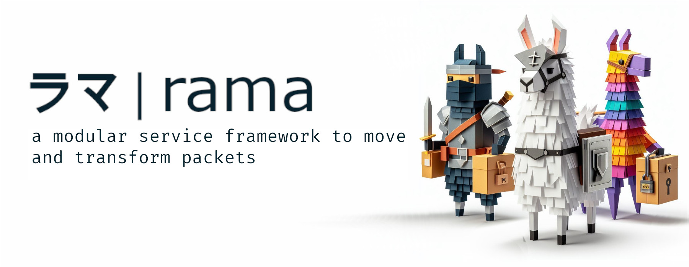

[](https://ramaproxy.org/)

[![Crates.io][crates-badge]][crates-url]
[![Docs.rs][docs-badge]][docs-url]
[![MIT License][license-mit-badge]][license-mit-url]
[![Apache 2.0 License][license-apache-badge]][license-apache-url]
[![Build Status][actions-badge]][actions-url]

[![Discord][discord-badge]][discord-url]
[![Buy Me A Coffee][bmac-badge]][bmac-url]
[![GitHub Sponsors][ghs-badge]][ghs-url]

[crates-badge]: https://img.shields.io/crates/v/rama.svg
[crates-url]: https://crates.io/crates/rama
[docs-badge]: https://img.shields.io/docsrs/rama/latest
[docs-url]: https://docs.rs/rama/latest/rama/index.html
[license-mit-badge]: https://img.shields.io/badge/license-MIT-blue.svg
[license-mit-url]: https://github.com/plabayo/rama/blob/main/LICENSE-MIT
[license-apache-badge]: https://img.shields.io/badge/license-APACHE-blue.svg
[license-apache-url]: https://github.com/plabayo/rama/blob/main/LICENSE-APACHE
[actions-badge]: https://github.com/plabayo/rama/workflows/CI/badge.svg
[actions-url]: https://github.com/plabayo/rama/actions?query=workflow%3ACI+branch%main

[discord-badge]: https://img.shields.io/badge/Discord-%235865F2.svg?style=for-the-badge&logo=discord&logoColor=white
[discord-url]: https://discord.gg/29EetaSYCD
[bmac-badge]: https://img.shields.io/badge/Buy%20Me%20a%20Coffee-ffdd00?style=for-the-badge&logo=buy-me-a-coffee&logoColor=black
[bmac-url]: https://www.buymeacoffee.com/plabayo
[ghs-badge]: https://img.shields.io/badge/sponsor-30363D?style=for-the-badge&logo=GitHub-Sponsors&logoColor=#EA4AAA
[ghs-url]: https://github.com/sponsors/plabayo

🦙 Rama is a modular proxy framework for the 🦀 Rust language to move and transform your network packets. You can use it to develop 🚦 reverse proxies, 🔓 TLS termination proxies, 🌐 HTTP(S) proxies, 🧦 SOCKS5 proxies and 🕵️‍♀️ distortion proxies. Rama is async-first using [Tokio](https://tokio.rs/) as its Async Runtime.

Please refer to [the examples found in the `./examples` dir](./examples) to get inspired on how you can use it for your purposes. There is no [crates.io](https://crates.io) release of rama yet. If you already want to start using rama already your can do so by referring to it in your `Cargo.toml` as follows:

```
rama = { git = "https://github.com/plabayo/rama" }
```

💬 Come join us at [Discord][discord-url] on the `#rama` public channel. To ask questions, discuss ideas and ask how rama may be useful for you.

> ⚠️ rama is early work in progress, use at your own risk.
>
> Not everything that exists is documented and not everything that is documented is implemented.

📖 Rama's full documentatuon, references and background material can be found in the form of the "rama book" at <https://ramaproxy.org/>.

## 🧭 | Roadmap

Please refer to <https://github.com/plabayo/rama/milestones> to know what's on the roadmap. Is there something not on the roadmap for the next version that you would really like? Please [create a feature request](https://github.com/plabayo/rama/issues) to request it and [become a sponsor](#sponsors) if you can.

## 💼 | License

This project is dual-licensed under both the [MIT license][mit-license] and [Apache 2.0 License][apache-license].

## 👋 | Contributing

🎈 Thanks for your help improving the project! We are so happy to have
you! We have a [contributing guide][contributing] to help you get involved in the
`rama` project.

Should you want to contribure this project but you do not yet know how to program in Rust, you could start learning Rust with as goal to contribute as soon as possible to `rama` by using "[the Rust 101 Learning Guide](https://rust-lang.guide/)" as your study companion. Glen can also be hired as a mentor or teacher to give you paid 1-on-1 lessons and other similar consultancy services. You can find his contact details at <https://www.glendc.com/>.

### Contribution

Unless you explicitly state otherwise, any contribution intentionally submitted
for inclusion in `rama` by you, shall be licensed as both [MIT][mit-license] and [Apache 2.0][apache-license],
without any additional terms or conditions.

[contributing]: https://github.com/plabayo/rama/blob/main/CONTRIBUTING.md
[mit-license]: https://github.com/plabayo/rama/blob/main/LICENSE-MIT
[apache-license]: https://github.com/plabayo/rama/blob/main/LICENSE-APACHE

### Acknowledgements

Special thanks goes to all involved in developing, maintaining and supporting [the Rust programming language](https://www.rust-lang.org/), the [Tokio ecosystem](https://tokio.rs/) and [all other crates](./Cargo.toml) that we depend upon.

Extra credits also go to [Axum](https://github.com/tokio-rs/axum), from which ideas and code were copied as its a project very much in line with the kind of software we want Rama to be, but for a different purpose. Our hats also go off to [Tower](https://github.com/tower-rs/tower), its inventors and all the people and creatures that help make it be every day. The initial code for the SOCKS5 support was copied from EAimTY's codebases.

## 💖 | Sponsors

Rama is **completely free, open-source software** which needs lots of effort and time to develop and maintain.

Support this project by becoming a [sponsor][ghs-url]. One time payments are accepted [at GitHub][ghs-url] as well as at ["Buy me a Coffee"][bmac-url]

Sponsors help us continue to maintain and improve `rama`, as well as other
Free and Open Source (FOSS) technology. It also helps us to create
educational content such as <https://github.com/plabayo/learn-rust-101>,
and other open source libraries such as <https://github.com/plabayo/tower-async>.

Sponsors receive perks and depending on your regular contribution it also
allows you to rely on us for support and consulting.

If you plan to use Rama for your commercial resell or package activities you
need to be a sponsor for a high enough tier to allow you to use it
for these purposes despite it having a Business License (BSL).

### Contribute to Open Source

Part of the money we receive from sponsors is used to contribute to other projects
that we depend upon. Plabayo sponsors the following organisations and individuals
building and maintaining open source software that `rama` depends upon:

| | name | projects |
| - | - | - |
| 💌 | [Tokio](https://github.com/tokio-rs) | (Tokio Project and Ecosystem)
| 💌 | [Sean McArthur](https://github.com/seanmonstar) | (Hyper and Tokio)
| 💌 | [Ratatui](https://github.com/ratatui-org/ratatui) | (TUI framework)
| 💌 | [Ulixee](https://github.com/ulixee) | (Browser Profile Data)

## ❓| FAQ

Available at <https://ramaproxy.org/man/faq.html>.
